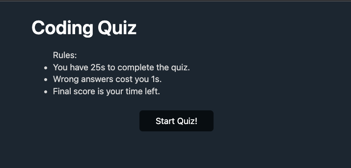
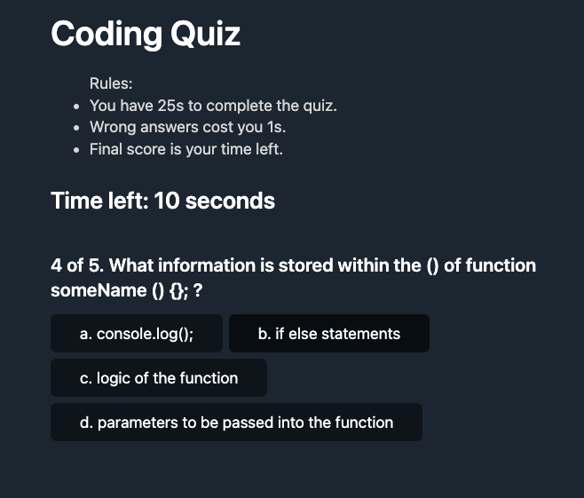
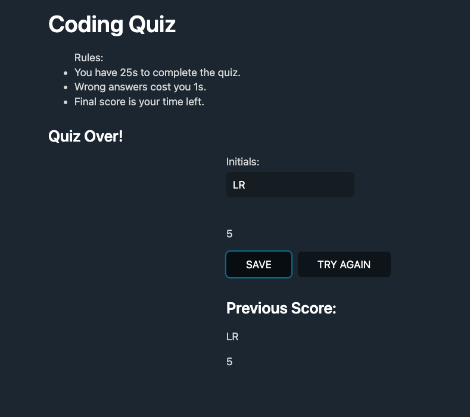

# codeQuiz-module4Challenge
[Link to my project](htttps://#)

## Table of Contents
 - [Description](#description)
 - [Visuals](#visuals)
 - [Acknowledgments](#Acknowledgments)

## Description
This Coding Quiz takes Javascript to a whole new level. Upon clicking "Start Quiz!", the logic in Javascript displays questions. Questions advancee when the user selects an answer. If the answer is incorrect, the user is penalized by taking away time. The final score, the time left, is displayed at the end. If the user completes the questions or the time runs out, the test is over. The user is then able to input their initials and save their score locally. User can try the quiz again and when they have complete the text again, their previous scores are displayed.

## Visuals
Below is a screenshot of the working website:

## Acknowledgments

https://watercss.kognise.dev/ 's public page was used to style the webpage. 